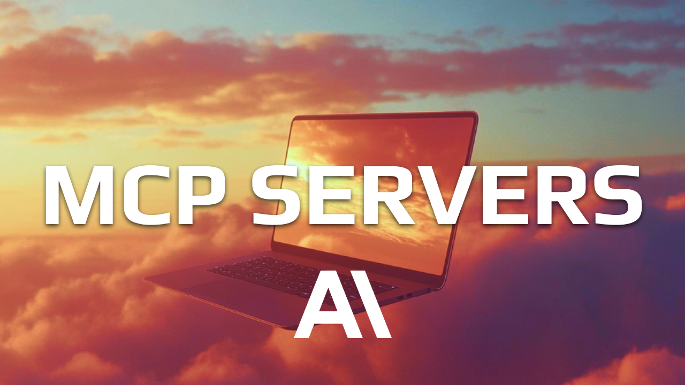

# MCP From Zero: Quick Data
> Purpose: Learn to build Powerful Model Context Protocol (MCP) servers by scaling tools into reusable agentic workflows (ADWs aka Prompts w/tools).

## Quick-Data
> Quick-Data is a MCP server that gives your agent arbitrary data analysis on .json and .csv files.
>
> We use quick-data as a concrete use case to experiment with the MCP Server elements specifically: Prompts > Tools > Resources.
>
> See [quick-data-mcp](quick-data-mcp/README.md) for details on the MCP server



## Leading Questions

We experiment with three leading questions:

1. How can we MAXIMIZE the value of custom built MCP servers by using tools, resources, and prompts TOGETHER?
2. What's the BEST codebase architecture for building MCP servers?
3. Can we build an agentic workflow (prompt w/tools) that can be used to rapidly build MCP servers?

## Understanding MCP Components

MCP servers have three main building blocks that extend what AI models can do:

### Tools
**What**: Functions that AI models can call to perform actions.

**When to use**: When you want the AI to DO something at a low to mid atomic level based on your domain specific use cases.

**Example**:
```python
@mcp.tool()
async def create_task(title: str, description: str) -> dict:
    """Create a new task."""
    # AI can call this to actually create tasks
    return {"id": "123", "title": title, "status": "created"}
```

### Resources
**What**: Data that AI models can read and access.

**When to use**: When you want the AI to READ information - user profiles, configuration, status, or any data source.

**Example**:
```python
@mcp.resource("users://{user_id}/profile")
async def get_user_profile(user_id: str) -> dict:
    """Get user profile by ID."""
    # AI can read this data to understand users
    return {"id": user_id, "name": "John", "role": "developer"}
```

### Prompts
**What**: Pre-built conversation templates that start specific types of discussions.

**When to use**: When you want to give the AI structured starting points for common, repeatable workflows for your domain specific use cases.

**Example**:
```python
@mcp.prompt()
async def code_review(code: str) -> str:
    """Start a code review conversation."""
    # AI gets a structured template for code reviews
    return f"Review this code for security and performance:\n{code}"
```

## Quick Decision Guide

- **Need AI to take action?** → Use **Tools**
- **Need AI to read data?** → Use **Resources**  
- **Need Reusable Agentic Workflows (ADWs)?** → Use **Prompts**

## Quick Setup

To use the Quick Data MCP server:

1. **Navigate to the MCP server directory**:
   ```bash
   cd quick-data-mcp/
   ```

2. **Configure for your MCP client**:
   ```bash
   # Copy the sample configuration
   cp .mcp.json.sample .mcp.json
   
   # Edit .mcp.json and update the --directory path to your absolute path
   # Example: "/Users/yourusername/path/to/quick-data-mcp"
   ```

3. **Test the server**:
   ```bash
   uv run python main.py
   ```

See [quick-data-mcp/README.md](quick-data-mcp/README.md) for complete setup and usage documentation.

## Resources
- MCP Clients: https://modelcontextprotocol.io/clients
- Claude Code Resource Support Github Issue: https://github.com/anthropics/claude-code/issuesç/545

## Master AI Coding
Learn to code with AI with foundational [Principles of AI Coding](https://agenticengineer.com/principled-ai-coding?y=jprompt)

Follow the [IndyDevDan youtube channel](https://www.youtube.com/@indydevdan) for more AI coding tips and tricks.

Use the best Agentic Coding Tool: [Claude Code](https://docs.anthropic.com/en/docs/claude-code/overview)